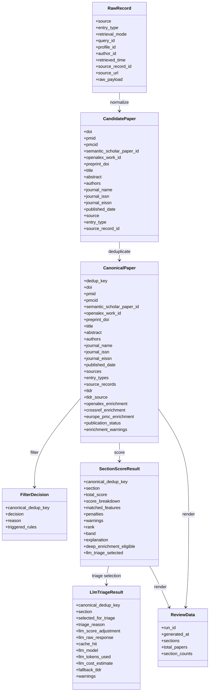

# Data Model

## State Files

Important state files include:

| File | Purpose |
|---|---|
| `state/seen_papers.parquet` | Seen-paper and first/last run tracking |
| `state/paper_status.parquet` | Review status and suppression state |
| `state/run_index.parquet` | Run history and health metadata |
| `state/llm_cache.parquet` | LLM response cache when enabled |
| `state/proposals/` | Review/config proposal files |
| `state/config_draft/` | Reviewable config drafts |
