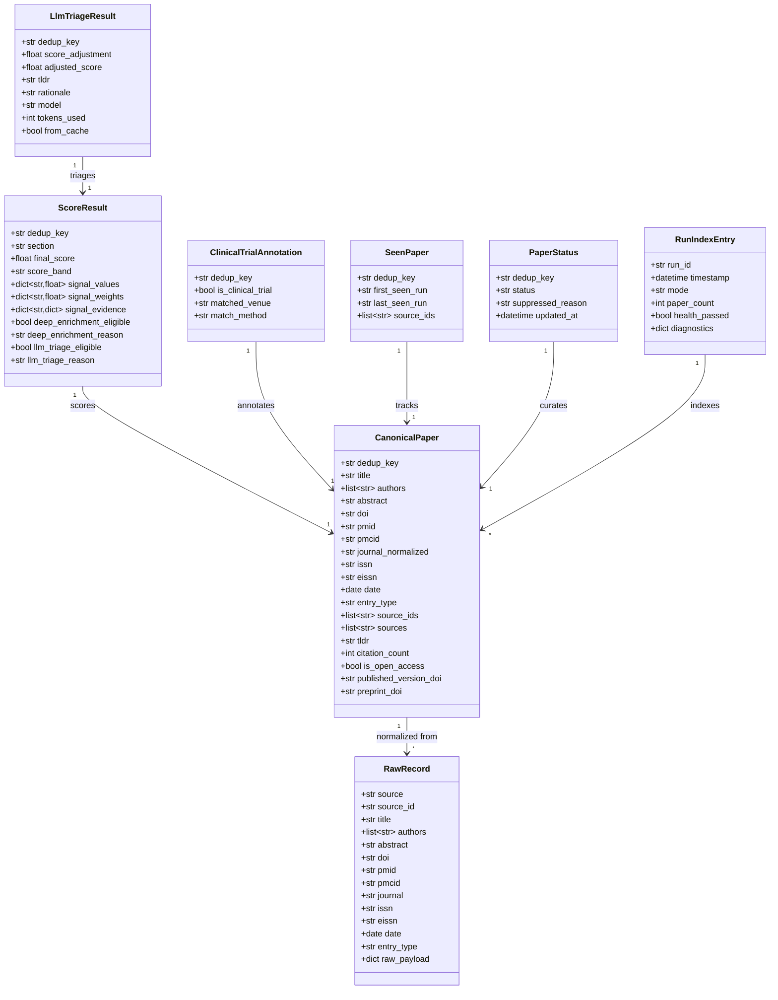
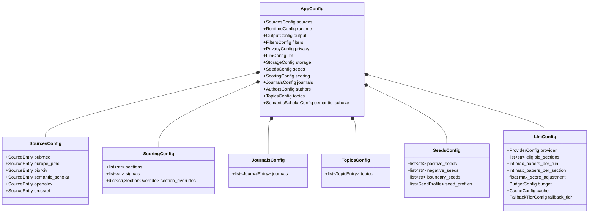

# Data Model

## Core Domain Models



## Config Model Hierarchy



## State File Schemas

### seen_papers.parquet
| Column | Type | Description |
|---|---|---|
| `dedup_key` | string | Canonical paper identifier (DOI > PMID > title hash) |
| `first_seen_run` | string | Run ID when first encountered |
| `last_seen_run` | string | Run ID when most recently seen |
| `source_ids` | list[string] | All source-specific IDs across runs |

### paper_status.parquet
| Column | Type | Description |
|---|---|---|
| `dedup_key` | string | Canonical paper identifier |
| `status` | string | `active`, `suppressed`, `starred`, `dismissed` |
| `suppressed_reason` | string | Why suppressed (if applicable) |
| `updated_at` | datetime | Last status change timestamp |

### run_index.parquet
| Column | Type | Description |
|---|---|---|
| `run_id` | string | Unique run identifier (ISO timestamp) |
| `timestamp` | datetime | Run start time (UTC) |
| `mode` | string | `daily`, `dry_run`, `backfill`, `manual` |
| `paper_count` | int | Total papers after filtering |
| `health_passed` | bool | Whether all health gates passed |
| `diagnostics` | struct | Source counts, timing, warnings |

### llm_cache.parquet
| Column | Type | Description |
|---|---|---|
| `prompt_hash` | string | SHA-256 of the full prompt |
| `response` | string | JSON-serialized LLM response |
| `model` | string | Model identifier |
| `created_at` | datetime | Cache entry timestamp |
| `tokens_used` | int | Total tokens for this request |

## Data Flow Between Phases

```
RawRecord[]  ──normalize──►  CanonicalPaper[]  ──dedup──►  CanonicalPaper[]
  (per source)                   (merged)                    (unique)

CanonicalPaper[]  ──enrich──►  CanonicalPaper[]  ──filter──►  CanonicalPaper[]
  (unique)                      (+TLDR, +citations)           (quality-gated)

CanonicalPaper[]  ──score──►  ScoreResult[]  ──triage──►  LlmTriageResult[]
  (quality-gated)               (11 signals)                 (adjusted)

ScoreResult[] + LlmTriageResult[] + ClinicalTrialAnnotation[]
  ──render──►  review_data.json → report.md, papers.csv, zotero.csv, ...
  ──state───►  seen_papers.parquet, paper_status.parquet, run_index.parquet
```
