# Pipeline Flow Diagram

```mermaid
flowchart TD
    START([Daily cron or manual trigger]) --> CONFIG[Load &amp; validate 13 YAML configs]
    CONFIG --> READINESS[Readiness checks<br/>offline-only: config validation<br/>retrieval simulation &amp; source counts]

    READINESS --> COMPILE[Compile retrieval strategy<br/>topics → query clauses<br/>journals → ISSN lookup<br/>seeds → S2 profiles]

    COMPILE --> RETRIEVE{Retrieval phase}

    RETRIEVE --> PUBMED[PubMed<br/>E-Utilities API<br/>MeSH + free text]
    RETRIEVE --> EPMC[Europe PMC<br/>REST API<br/>title/abstract search]
    RETRIEVE --> BIORXIV[bioRxiv<br/>API<br/>posted date window]
    RETRIEVE --> S2[Semantic Scholar<br/>Recommendations API<br/>seed DOI → similar papers]
    RETRIEVE --> AUTH[Author Tracked<br/>ORCID → publications<br/>date-filtered]

    PUBMED --> AGGREGATE[Aggregate raw records<br/>count per source<br/>track failures]
    EPMC --> AGGREGATE
    BIORXIV --> AGGREGATE
    S2 --> AGGREGATE
    AUTH --> AGGREGATE

    AGGREGATE --> NORMALIZE[Normalization<br/>journal name → canonical<br/>ISSN matching]
    NORMALIZE --> DEDUP[Deduplication<br/>DOI · PMID · title hash<br/>cross-source merge]

    DEDUP --> ENRICH[Enrichment<br/>Semantic Scholar → TLDRs<br/>OpenAlex → OA status<br/>Crossref → metadata]

    ENRICH --> FILTER[Filtering<br/>9-rule guardrail pipeline<br/>technical · type · quality<br/>suppression state]

    FILTER --> SCORE[Scoring engine<br/>10 registered signals × section weights<br/>topic · journal · recency<br/>metadata · access · preprint]

    SCORE --> CLINICAL[Clinical trial annotation<br/>high-level venue matching]

    CLINICAL --> LLM_CHECK{LLM triage<br/>enabled?}

    LLM_CHECK -->|yes| LLM_BUDGET[Budget check<br/>tokens · cost · cache]
    LLM_CHECK -->|no| RENDER

    LLM_BUDGET -->|within budget| LLM_TRIAGE[LLM triage<br/>score adjustment<br/>TLDR generation]
    LLM_BUDGET -->|budget exhausted| LLM_SKIP[Skip triage<br/>use fallback TLDR]

    LLM_TRIAGE --> RENDER
    LLM_SKIP --> RENDER

    RENDER[Render outputs]
    RENDER --> OUT_JSON[review_data.json]
    RENDER --> OUT_MD[report.md]
    RENDER --> OUT_CSV[papers.csv]
    RENDER --> OUT_ZOTERO[zotero.csv]
    RENDER --> OUT_SUPPRESSED[suppressed.csv]
    RENDER --> OUT_SUMMARY[run_summary.json]

    OUT_JSON --> STATE[Update state]
    OUT_MD --> STATE
    OUT_CSV --> STATE
    OUT_ZOTERO --> STATE
    OUT_SUPPRESSED --> STATE
    OUT_SUMMARY --> STATE

    STATE --> SEEN[seen_papers.parquet]
    STATE --> STATUS[paper_status.parquet]
    STATE --> INDEX[run_index.parquet]
    STATE --> LLM_CACHE[llm_cache.parquet]

    SEEN --> HEALTH[Health gates]
    STATUS --> HEALTH
    INDEX --> HEALTH

    HEALTH --> GATE1{source_health}
    GATE1 -->|pass| GATE2{output_health}
    GATE1 -->|fail| NO_PROMOTE
    GATE2 -->|pass| GATE3{curation_size}
    GATE2 -->|fail| NO_PROMOTE
    GATE3 -->|pass| GATE4{exclude_rate}
    GATE3 -->|fail| NO_PROMOTE
    GATE4 -->|pass| PROMOTE[Promote to outputs/latest/]
    GATE4 -->|fail| NO_PROMOTE

    PROMOTE --> NOTIFY[Email notification]
    NO_PROMOTE --> NOTIFY

    NOTIFY --> PRUNE[Prune old snapshots<br/>retain_runs: 30]
    PRUNE --> DONE([Done])
```

## Phase Details

### Retrieval Phase
Each source is independently called with date windows from `runtime.yml`
(`newest_offset_days: 1`, `oldest_offset_days: 7`). Failures are tracked via
`source_reliability.py` and reported in run diagnostics. The
`partial_failure_policy` setting controls whether a single source failure halts
the pipeline or warns and continues.

### Processing Phase
Papers flow through normalization → dedup → enrichment → filtering
sequentially. Each phase transforms the paper list and may drop or merge
entries. The filtering phase is the primary quality gate before scoring.

### Scoring Phase
The 10-signal engine computes per-paper scores within each section. Sections
define which signals are active and their weights. Papers are ranked within
their section and assigned score bands (high/medium/low).

### LLM Triage Phase (optional)
Top-ranked papers (up to `max_papers_per_section` per section, capped at
`max_papers_per_run` total) are sent to the LLM for score adjustment. The LLM
can nudge scores up or down within `max_score_adjustment`. Responses are
cached by prompt hash to avoid redundant API calls.

### Output & State Phase
Six output formats are rendered (controlled by `output.yml` toggles). State
files are atomically written. Health gates run on the completed output, and if
all pass, the snapshot is promoted to `outputs/latest/`.
