# Pipeline Flow Diagram

```mermaid
flowchart TD
    START([Manual or scheduled trigger]) --> CONFIG["Load strict config<br/>13 YAML files"]
    CONFIG --> WINDOW["Compute runtime window<br/>timezone + offsets"]
    WINDOW --> STRATEGY["Compile retrieval strategy<br/>offline source/query plan"]
    STRATEGY --> MODE{"runtime.mode == dry_run?"}
    MODE -->|yes| EMPTY["Skip source retrieval"]
    MODE -->|no| RETRIEVE["Retrieve enabled sources<br/>PubMed, Europe PMC, bioRxiv,<br/>Semantic Scholar Recommendations,<br/>tracked authors"]
    EMPTY --> NORMALIZE
    RETRIEVE --> NORMALIZE["Normalize RawRecord<br/>to CandidatePaper"]
    NORMALIZE --> DEDUP["Deduplicate to CanonicalPaper<br/>identifier-first"]
    DEDUP --> ENRICH["Enrich metadata<br/>S2, OpenAlex, Crossref,<br/>Europe PMC, bioRxiv status"]
    ENRICH --> FILTER["Filter<br/>hard guardrails + configured rules<br/>formal journal whitelist"]
    FILTER --> SCORE["Score by section<br/>10 registered signals"]
    SCORE --> CLINICAL["Clinical-trial venue annotation"]
    CLINICAL --> LLM{"LLM triage enabled<br/>and candidates selected?"}
    LLM -->|yes| TRIAGE["Budget/cache/schema-validated<br/>LLM triage"]
    LLM -->|no| RENDER
    TRIAGE --> RERANK["Section-local rerank/reband"]
    RERANK --> RENDER
    RENDER["Render outputs<br/>full audit + curated review"] --> STATE["Update state<br/>seen, status, run index"]
    STATE --> HEALTH["Health gates<br/>source, output, curation,<br/>exclude rate, policy"]
    HEALTH --> PROMOTE{"healthy?"}
    PROMOTE -->|yes| LATEST["Promote snapshot<br/>to outputs/latest"]
    PROMOTE -->|no| DIAG["Keep diagnostics<br/>do not claim clean success"]
    LATEST --> NOTIFY["Notify when configured"]
    DIAG --> NOTIFY
    NOTIFY --> DONE([Done])
```

## Notes

- `dry_run` skips source retrieval but can still write local run artifacts.
- Semantic Scholar daily Search is deferred; current daily S2 retrieval uses
  Recommendations.
- `static_html` is planned only and is not rendered.
